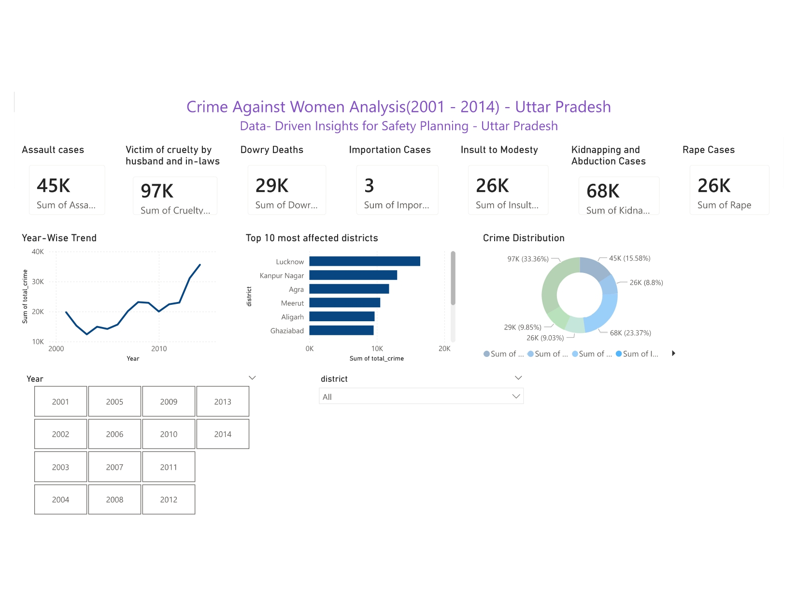

# 🚨 Crime Against Women Analysis - Uttar Pradesh (2001-2014)

## 📊 Project Overview

Interactive Power BI dashboard analyzing 14 years of crime data across Uttar Pradesh to identify patterns in crimes against women and support data-driven safety planning.

## 🎯 Objective

To analyze crime patterns against women in Uttar Pradesh and provide actionable insights for policymakers, law enforcement, and NGOs to implement targeted safety interventions.

## 📁 Dataset

- *Source:* Kaggle - Crime Against Women 2001-2014(India)
- *Time Period:* 2001 - 2014 (14 years)
- *Geographic Coverage:* 70+ districts in Uttar Pradesh
- *Records:* 1,032 data points
- *Crime Categories:* 7 types
  - Rape
  - Kidnapping & Abduction
  - Dowry Deaths
  - Assault to Outrage Modesty
  - Insult to Modesty of Women
  - Cruelty by Husband/In-laws
  - Importation of Girls

## 🔍 Key Insights

### 1️⃣ Crime Type Distribution
- *Cruelty by Husband/In-laws* is the most prevalent crime (33.36% of total cases)
- Second highest: Kidnapping & Abduction (23.37%)
- Rape cases account for 8.8% of total crimes

### 2️⃣ Geographic Patterns
- *Top 3 Most Affected Districts:*
  1. Lucknow
  2. Kanpur Nagar
  3. Agra
- These districts require priority resource allocation

### 3️⃣ Temporal Trends
- Crime rates showed a *declining trend from 2001-2010*
- *Sharp spike observed post-2010*, indicating need for policy review
- Year 2011 marked significant increase in reported crimes

### 4️⃣ Actionable Recommendations
- Increase women helpline resources in top 10 affected districts
- Focus awareness campaigns on domestic violence (highest category)
- Implement targeted patrolling in identified high-risk areas
- Seasonal analysis suggests increased vigilance during specific periods

## 🛠️ Tools & Technologies

| Category | Tools |
|----------|-------|
| *Data Cleaning & EDA* | Python (pandas) |
| *Visualization* | Python (matplotlib, seaborn) |
| *Dashboard* | Power BI Desktop |

## 📈 Dashboard Features

✅ *7 KPI Cards* - Total crimes by category at a glance  
✅ *Year-wise Trend Analysis* - Interactive line chart showing crime patterns over time  
✅ *Top 10 Districts* - Bar chart identifying most affected regions  
✅ *Crime Distribution* - Donut chart showing percentage breakdown  
✅ *Interactive Filters* - Year and district slicers for dynamic exploration  
✅ *Responsive Design* - Clean, professional layout with appropriate color scheme  

## 📂 Repository Structure)

## 🎯 Objective

To analyze crime patterns against women in Uttar Pradesh and provide actionable insights for policymakers, law enforcement, and NGOs to implement targeted safety interventions.

## 📁 Dataset

- *Source:* Kaggle - Crime Against Women 2001-2014 (India)
- *Time Period:* 2001 - 2014 (14 years)
- *Geographic Coverage:* 70+ districts in Uttar Pradesh
- *Records:* 1,032 data points
- *Crime Categories:* 7 types
  - Rape
  - Kidnapping & Abduction
  - Dowry Deaths
  - Assault to Outrage Modesty
  - Insult to Modesty of Women
  - Cruelty by Husband/In-laws
  - Importation of Girls

## 🔍 Key Insights

### 1️⃣ Crime Type Distribution
- *Cruelty by Husband/In-laws* is the most prevalent crime (33.36% of total cases)
- Second highest: Kidnapping & Abduction (23.37%)
- Rape cases account for 8.8% of total crimes

### 2️⃣ Geographic Patterns
- *Top 3 Most Affected Districts:*
  1. Lucknow
  2. Kanpur Nagar
  3. Agra
- These districts require priority resource allocation

### 3️⃣ Temporal Trends
- Crime rates showed a *declining trend from 2001-2010*
- *Sharp spike observed post-2010*, indicating need for policy review
- Year 2011 marked significant increase in reported crimes

### 4️⃣ Actionable Recommendations
- Increase women helpline resources in top 10 affected districts
- Focus awareness campaigns on domestic violence (highest category)
- Implement targeted patrolling in identified high-risk areas
- Seasonal analysis suggests increased vigilance during specific periods

## 🛠️ Tools & Technologies

| Category | Tools |
|----------|-------|
| *Data Cleaning & EDA* | Python (pandas) |
| *Visualization* | Python (matplotlib, seaborn) |
| *Dashboard* | Power BI Desktop |

## 📈 Dashboard Features

✅ *7 KPI Cards* - Total crimes by category at a glance  
✅ *Year-wise Trend Analysis* - Interactive line chart showing crime patterns over time  
✅ *Top 10 Districts* - Bar chart identifying most affected regions  
✅ *Crime Distribution* - Donut chart showing percentage breakdown  
✅ *Interactive Filters* - Year and district slicers for dynamic exploration  
✅ *Responsive Design* - Clean, professional layout with appropriate color scheme  

## 📂 Files in This Repository

├── README.md                                     # Project documentation
├── dasg_page-001.jpg                             # Dashboard image
├── dasgf.pdf                                     # PDF export
├── up_women_crime.csv                            # Cleaned dataset
└── crime_against_women_analysis.ipynb            # Python notebook 

